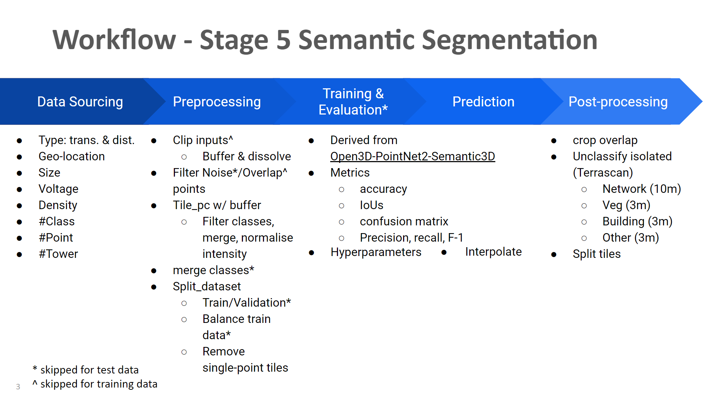
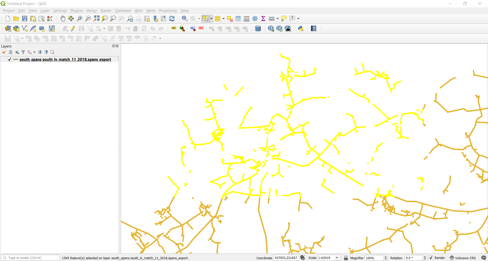
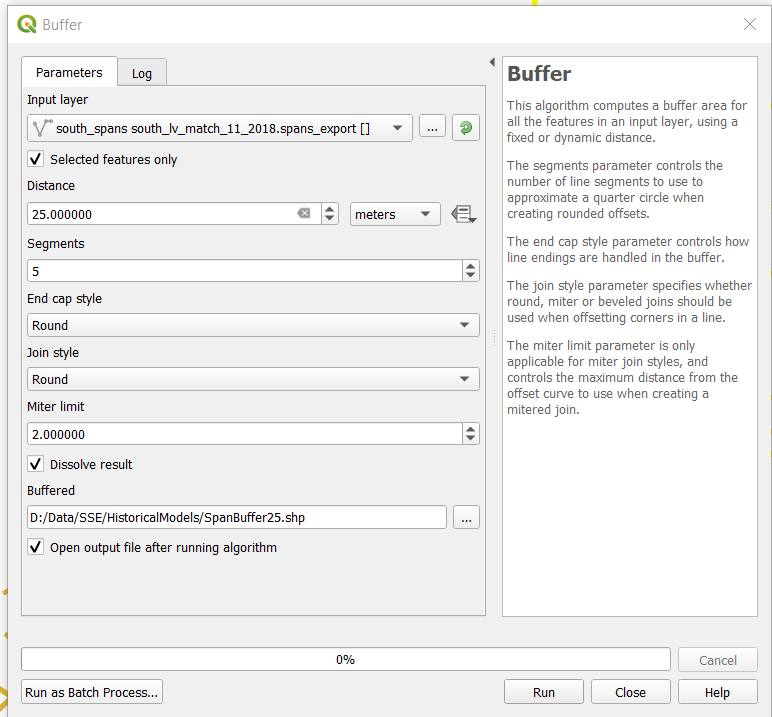

# Auto-segmentation of Point Cloud

## Introduction
This is the program developed for Stage 5 of NMRX12030. The purpose of this project is to tune the program created for Stage 3 towards distribution projects.

This program segments point clouds into a number of classes, e.g. Network (Powerline Structure + Conductor), Vegetation, Building, Others, Noise.

This program is also used to train the SSE models for the Stage 4 Deployment Trial 2.

## Dependency
Follow instructions in `G:\Shared drives\NMRX12030 Automated Classification KTP\06_Training_Material\Set_Up_ML_Environment.docx` to setup ML environment.

## Usage
### 0. Compile TF Ops
We need to build TF kernels in `tf_ops`. First, make sure TF can be found with current python. The following line shall run without error.
```shell
python -c "import tensorflow as tf"
```
Then build TF ops. 
```shell
cd ../tf_ops
mkdir build
cd build
cmake ..
make
```
After compilation the following `.so` files shall be in the `build` directory.
```shell
tf_ops/build
├── libtf_grouping.so
├── libtf_interpolate.so
├── libtf_sampling.so
├── ...
```
Verify that that the TF kernels are working by running
```shell
cd .. # Now we're at tf_ops/
python test_tf_ops.py
```

The following steps illustrate the application on UKPN sample data.



### 1. Data Sourcing
1. Copy classified point clouds from `W:\NMRX12030\Stage4\Round2-SegmentDx\Data\NMLP18102-UKPN\Product30\Area2` to local with the folder strucutre below: 
```shell
UKPN
├── Area2
    ├── TF710420.laz
	├── TF710425.laz
	├── ...
```
2. Analyse dataset, e.g. visual inspection, statistics

### 2. Preprocessing
 1. (Optional) This step is only useful when we have the historical models of a project.
 
When applying trained models (i.e. inference-only senario), due the large size of an area in Dx projects, we may want to reduce the input data size to save time for running the workflow, especially for the Prediction step. For this we could clip the input area into corridors with the pre-condition that the historical spans model of the same project is available. Since we have the historical models of SSE instead of UKPN, the following instructions for this optional step is based on SSE data.

First, we need to prepare a cooridor shapefile for a selected area. Copy historical spans model of SSE [south_spans.sqlite](https://drive.google.com/drive/folders/1qMg2fHatl8rnEBuFvn5_68rFZIh0Rtum?usp=sharing) to a Windows PC. Drag and drop the model in QGIS, and click `QuickMapServices->Google->Goolge Hybrid`. Since the model is for the whole SSE project, QGIS crashes when processing it in one go. Therefore, we have to select the features that are in an area of interest. Open `G:\Shared drives\NMG Live Projects\NMLP20024 SSE 2020\04. Project Analysis\NMLP20024-PM-SoW-KMZ-A02.kmz`in Google Earth and locate the area (e.g. Area 71). In QGIS, click `Select Features by area` and draw a rectangle that includes the area location found in Google Earch. The seleted features will light up as shown below:

Click `Vector->Geoprocessing Tools->Buffer` and set the parameters in the pop-up window:

Example of genearted corridor shapefile for Area 71 is available at `W:\NMRX12030\Stage4\Round2-SegmentDx\Data\NMLP20024 SSE 2020\Demo3_corridor_shape`.

Second, we need to clip Product 24 using the shapefile generated above. Update the paths in `preprocess/clip.py`, then run the script:
```shell
python preprocess/clip.py
```
 Example of clipped data is available at `W:\NMRX12030\Stage4\Round2-SegmentDx\Data\NMLP20024 SSE 2020\Preprocessed\Intermediate\Demo3_clipped\A71`.
 
2. Update  `preprocess/configs/config.json`:

| Variable | Description | Option |
|--|--|--|
| base_dir | The root directory of the input/output data | e.g. "/media/nan/InternalDrive/KTP/data" |
| project | The prefix of input & output folders | e.g. "UKPN" |
| pdal_config | The PDAL configuration file used in the 'merge_classes' step in Preprocessing. This is only used for preparing train & validation data. | e.g. "/media/nan/InternalDrive/KTP/segment_point_cloud/preprocess/configs/Filter-UKPN.json" |
| lastools_path | The path to LASTools executables | e.g. "/home/nan/wine/LasTools" |
| keep_noise | The flag of whether to keep manually classified Noise points. This should only be activated when 'data_split' is set as 'train'. | 0 or 1 |
| temp_class | The tempoary class code used for the filtered Noise/Overlap class. This should not be already used in the input class codes so it's project dependent. | e.g. "9" |
| keep_overlap | The flag of whether to keep Overlap points that are 'overlap_hag_range' meters above ground. This should only be activated when 'data_split' is set as 'test'.  | 0 or 1 |
| overlap_hag_range | The filter range of Height Above Ground, passed to `-classify_between` in [lasheight](http://lastools.org/download/lasheight_README.txt)  | e.g. [2.0, 70.0] |
| drop_class | The classes marked as "remove" or "-" in `G:\Shared drives\NMRX12030 Automated Classification KTP\04_Design\Data\ClassDefinition.xlsx`. It's project dependent. This variable is passed to `-drop_class` in [lastile](http://lastools.org/download/lastile_README.txt) | e.g. [1, 2, 3, 7, 12, 26, 27, 29, 30, 31] |
| devide_intensity_by | The scale factor for normalising intensity values.| e.g. 255 |
| tile_length | The length of retiled point cloud, passed to `-tile_size` in [lastile](http://lastools.org/download/lastile_README.txt)| e.g. 20 |
| tile_buffer | The length of buffered area, passed to `-buffer` in [lastile](http://lastools.org/download/lastile_README.txt)| e.g. 1.5 |
| data_split | The name of dataset | "train" or "test" |
| prob_data_split | The percentage of data used for train & validation data | e.g. [0.95, 0.05]|
| keep_all | The list of class codes used to identify essential tiles. This is only used for train data. All tiles with points of the specifed class code are considered as essential and will be kept. | e.g. [1]|
| train_prob_essential | The probablity of removing or keeping non-essential tils for train data. | e.g. [1, 0]|
| val_prob_essential | The probablity of removing or keeping non-essential tils for validation data. | e.g. [1, 0]|

Prepare PDAL configuration file (e.g. `preprocess/configs/Filter-UKPN.json`) that will be used in the `merge_classes` step. This file is project dependent and only used for train & validation data. Only update the `filters.assign` sections according to the KTP class definition, e.g.:
```shell
{   
		"type":"filters.assign",
		"assignment" : "Classification[4:5]=2"
},
```


3. If `keep_noise` is active, copy unclassified point clouds from `W:\NMRX12030\Stage4\Round2-SegmentDx\Data\NMLP18102-UKPN\Product24\Area2` to the path specified by `base_dir` above with the folder strucutre below: 
```shell
UKPN_p24
├── Area2
    ├── TF710420.laz
	├── TF710425.laz
	├── ...
```
4. Preprocess 
```shell
python preprocess/preprocess.py --config_file preprocess/configs/config.json
```
Example output data is available at `W:\NMRX12030\Stage5\NMLP18102-UKPN\Sample\Data\Preprocessed\A2_points`

### 3. Training & Validation
1. Update model configuration file `configs/UKPNTest.json`.

| Variable | Description | Option | 
|--|--|--|
| gpu | The ID of GPU to use | "0" |
| num_classes | The number of classes used in the ML model | e.g. 4 |
| labels_names | The name of classes used in the ML model | e.g. [ "Other", "Network", "Veg", "Building"] |
| logdir | The path to log models during training| e.g. "log/UKPNTest1" |
| data_path | The input to feed into the ML model, i.e. the output of the Preprocessing | e.g. "/media/external/data/UKPN_points" |
| output_dir | The name of outputs | e.g. "UKPNTest1" |
| train_areas | The name of the train data folder | ["train"] |
| validation_areas | The name of the validation data folder | ["validation"] |
| test_areas | The name of the test data folder | ["test"] |
| start_epoch | The ID of the model's first epoch to be trained.| e.g. 0 |
| max_epoch | The ID of the model's last epoch to be trained.| e.g. 100 |
| num_point | The number of points fed into the ML model.| e.g. 8192 |
| batch_size | The number of tiles processed in a batch. It's limited by the GPU memory size.| e.g. 32 |
| num_additional_inputs | The number of input channels (e.g. HeightAboveGround, Intensity) in addition to X/Y/Z.| e.g. 4 |
| loss_func | The loss function used in training, Cross Entropy loss or Focal loss (not used in Stage 5)| "ce" |
| focusing_param, balancing_factor | The params used in the Focal loss function (not used in Stage 5)| (ignore) |
| optimizer | The optimiser used for training, Adam or Momentum (not used in KTP)| "adam" |
| momentum | The param used for Momentum optimizer (not used in KTP)| (ignore) |
| learning_rate | The learning rate for training| 0.001 |
| decay_step, learning_rate_decay_rate | The params used for learning rate decay| 0.7 |
| box_size_x, box_size_y | The size of the input box drawn for a tile. This is project dependent and can be scaled according to point density. | e.g. 23 |
| bn_init_decay, bn_decay_decay_rate | The params used for batch normalisation | 0.5 |
| bn_decay_clip | The param used for batch normalisation | 0.99 |
| l(x)_radius, l(x)_nsample, l(x)_npoint  | The params used in each of the network layers for local neigbourhood. Refer to Project Reports & Model Descriptions on how to calculate these. | e.g. {"l1_radius": 0.55," l1_nsample": 32,"l1_npoint": 1024, "l2_radius": 1.56, "l2_nsample": 32,"l2_npoint": 256,"l3_radius": 6.25,"l3_nsample": 32,"l3_npoint": 64,"l4_radius": 25.0,"l4_nsample": 32,"l4_npoint": 16} |

2. To train a model from scratch:
```shell
python train.py --config_file configs/UKPNTest.json
```
By default, the training set will be used for training and the validation set will be used for validation. To train with both training and validation set, use the `--train_set=train_full` flag. 
To continue training from a pre-trained model:
```shell
python train.py --config_file configs/UKPNTest.json --ckpt log/UKPNTest5/best_model_epoch_055.ckpt --best_iou 0
```
The best trained model is available at `W:\NMRX12030\Stage5\NMLP18102-UKPN\Sample\Model\UKPNTest5`
### 4. Prediction
1. Copy one or multiple models (one model is represented by `.ckpt.data-00000-of-00001` & `.ckpt.meta` & `.ckpt.index`) to a folder specified in the `--ckpt_dir` flag. When multiple checkpoints are available, the script uses ensemble learning to combine the predictions from all models. In order to use the ensemble model, update the `ensemble_weights` parameter in the configuration file (e.g. `configs/UKPNTest.json`) with the IoU per class for each of the models. The IoUs are available when these models were validated during training. If an average ensemble is preferred than the weighted ensemble, just set all the weights as 1.

2. Apply models to unclassified points. The prediction dataset is configured by `--set`. Since PointNet2 only takes a few thousand points per forward pass, we need to sample from the prediction dataset multiple times to get a good coverage of the points. Each sample contains the few thousand points
required by PointNet2. To specify the number of such samples per scene, use the `--num_samples` flag.
```shell
python predict.py --config_file configs/UKPNTest.json \
                  --ckpt_dir models \  
	              --set=validation \	
			      --num_samples=50
```
The prediction results will be written to `result/sparse`.

3. The next step is to interpolate the prediction to the full point cloud and remove duplicated points.
```shell
python interpolate.py --config_file configs/UKPNTest.json --set validation --gt UKPN_merged/Area2
```
The `--gt` flag is only used for generating metrics to evaluate results. Therefore, it's not required for test dataset.
The prediction results will be written to `result/dense`.

### 5. Post-processing
1. Update `postprocess/config.json`

| Variable | Description |Option |
|--|--|--|
| in_dir | The path to the interpolated results | e.g. "/media/external/segment_las/result/dense/SSE-D_Demo1_2/test"|
| out_dir | The path to the postprocessed results | e.g. "/media/external/segment_las/result/postprocess/SSE-D_Demo1_2"|
| point_dir | The path to the preprocessed LAZ tiles. This is the area/cluster folder in the `_merged`(for train & validation data) or `_tiled`(for test/demo data) folder. | e.g. "/media/external/data/SSE/Demo1_2_tiled/A3"|
| lastools_path | The path to LASTools executables | e.g. "/home/nmgml/wine/LasTools"|
| multiply_intensity_by | The scale factor for recovering Intensity values. This should be the same value as used in Preprocessing. | e.g. "255"|


2. Postprocess 
```shell
cd postprocess
python postprocess.py --config_file config.json
```
The final outputs are LAS files containing the same geographical region as from the original LAS data. To visually inspect the outputs, load the LAS files into CloudCompare/Microstation etc.

Demo data for this application is available at `W:\NMRX12030\Demo\AutoSegmentation\Data\NMLP18102-UKPN`.

3. Run the `Terrascan/CleanIsolatedPoints.mac` in MicroStation on Windows to clean the results by identifying isolated points for each classes. Currently this step is skipped when preparing the UKPN demo data. The Stage 4 SSE demo data (refer to link below), however, is generated after this step.

### Note
The `*.slurm` scripts are for using the Durham University's NCC GPU cluster.

## Future Actions
 1. Refine the Terrascan macro in Post-processing, based on requirements of a specific deployment project.
 2. The deployment version of this program is not implemented yet. For the implementation, modify [NMAP19085_segment_point_cloud_pipeline](https://bitbucket.trimble.tools/projects/NMGROUP/repos/nmap19085_segment_point_cloud_pipeline/browse?at=refs%2Fheads%2Ffeature%2Fdata-pipeline) so the pre- & post-processing is consistent with this program. Do not use the [NMAP19085_segment_point_cloud_pipeline](https://bitbucket.trimble.tools/projects/NMGROUP/repos/nmap19085_segment_point_cloud_pipeline/browse?at=refs%2Fheads%2Ffeature%2Fdata-pipeline)  codes directly with models trained using this program becuase the different methods of pre- & post-processing will affect the results.

## Documentations
| Desctiption | Path |
|--|--|
| Stage 5 Report | G:\Shared drives\NMRX12030 Automated Classification KTP\04_Design\Documentation\Methodology_Stage5.docx |
| Stage 4 Report | G:\Shared drives\NMRX12030 Automated Classification KTP\04_Design\Documentation\Methodology_Stage4.docx |
| Descriptions of UKPN models | G:\Shared drives\NMRX12030 Automated Classification KTP\04_Design\Result\Stage5-Models-UKPN.xlsx |
| Description of Stage 5 SSE models | G:\Shared drives\NMRX12030 Automated Classification KTP\04_Design\Result\Stage5-Models-SSE.xlsx|
| Description of Stage 4 SSE models | G:\Shared drives\NMRX12030 Automated Classification KTP\04_Design\Result\Stage4-SSE.xlsx|
## Data
| Desctiption | Path |
|--|--|
| Unclassified UKPN point clouds | W:\NMRX12030\Stage4\Round2-SegmentDx\Data\NMLP18102-UKPN\Product24 |
| Manually classified UKPN point clouds | W:\NMRX12030\Stage4\Round2-SegmentDx\Data\NMLP18102-UKPN\Product30 |
| Preprocessed UKPN point clouds | W:\NMRX12030\Stage4\Round2-SegmentDx\Data\NMLP18102-UKPN\Preprocessed |
| Manually classified SSE point clouds | W:\NMRX12030\Stage5\NMLP19104-SSE\Product30 |
| Preprocessed Stage 5 SSE point clouds | W:\NMRX12030\Stage5\NMLP19104-SSE\preprocess |
| Preprocessed Stage 4 SSE point clouds | W:\NMRX12030\Stage4\Round2-SegmentDx\Data\NMLP20024 SSE 2020\Preprocessed |
| Stage 5 SSE demo | W:\NMRX12030\Demo\AutoSegmentation\Data\NMLP19104-SSE_Trial| 
| Stage 4 SSE demo | W:\NMRX12030\Demo\AutoSegmentation\Data\NMLP20024 SSE 2020, W:\NMRX12030\Stage4\Round2-SegmentDx\Data\NMLP20024 SSE 2020\Demo| 
| Trained UKPN models | W:\NMRX12030\Stage5\NMLP18102-UKPN\Model |
| Trained Stage 5 SSE models | W:\NMRX12030\Stage5\NMLP19104-SSE\Model|
| Trained Stage 4 SSE models | W:\NMRX12030\Stage4\Round2-SegmentDx\Model |
